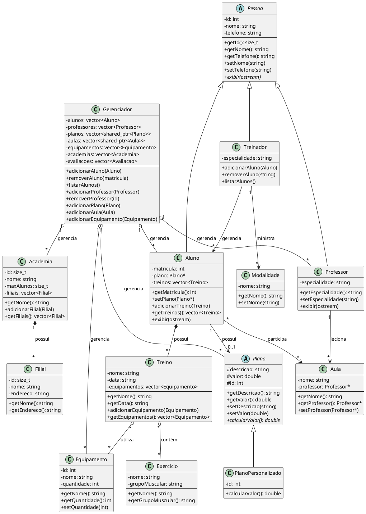

# Diagrama UML - Sistema de Gerenciamento de Academia

## Arquivo PlantUML

## Descrição das Classes

### Interfaces
- **IIdentificavel**: Define métodos para objetos que possuem identificadores únicos
- **IFilePersistable**: Define métodos para persistência de dados em arquivos

### Hierarquia de Pessoas
- **Pessoa**: Classe base para todas as pessoas (id, nome, telefone)
- **Professor**: Estende Pessoa, adiciona especialidade
- **Aluno**: Estende Pessoa, adiciona matrícula, plano, treinos
- **Treinador**: Estende Pessoa, adiciona especialidade

### Planos
- **Plano**: Classe base para planos de academia
- **PlanoPersonalizado**: Estende Plano com características personalizadas

### Entidades Principais
- **Academia**: Representa uma academia de ginástica com múltiplas filiais
- **Filial**: Representa uma filial de uma academia
- **Aula**: Representa uma aula oferecida por um professor
- **Treino**: Representa um plano de treino com equipamentos
- **Equipamento**: Representa equipamentos disponíveis
- **Avaliacao**: Representa avaliações feitas por alunos

### Gerenciador
- **Gerenciador**: Classe central que gerencia todas as operações CRUD de todas as entidades
- Implementa persistência de dados em arquivos (bin/)
- Carrega dados automaticamente dos arquivos ao buscar entidades

## Persistência de Dados

Os arquivos de persistência estão em `bin/`:
- `alunos.txt` - Lista de alunos
- `professores.txt` - Lista de professores
- `planos.txt` - Lista de planos
- `planos_personalizados.txt` - Planos personalizados
- `aulas.txt` - Aulas oferecidas
- `equipamentos.txt` - Equipamentos disponíveis
- `avaliacoes.txt` - Avaliações realizadas
- `academias.txt` - Academias cadastradas
- `filiais.txt` - Filiais das academias
- `treinos.txt` - Treinos dos alunos

## Fluxo Principal

1. O programa começa no `main.cpp` com um menu interativo
2. O usuário escolhe uma opção para gerenciar diferentes entidades
3. O Gerenciador carrega dados dos arquivos conforme necessário
4. Operações CRUD são realizadas na memória
5. Mudanças são imediatamente persistidas nos arquivos
6. Dados são recarregados quando necessário garantir sincronização
